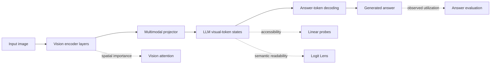
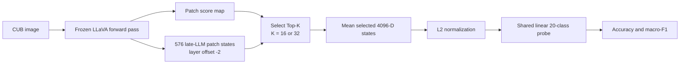
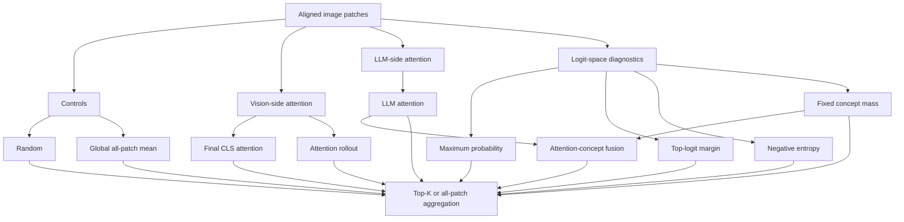
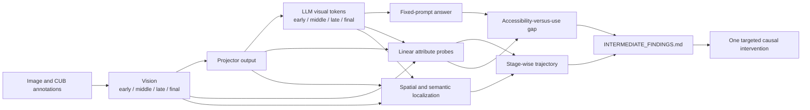

# Technical Report: Phase 01B Patch-Selector Study and Evidence-Tracing Roadmap

**Project:** Fine-Grained Evidence Tracing in Vision-Language Models  
**Target:** ICLR 2027  
**Status date:** 5 September 2026
**Model:** `llava-hf/llava-1.5-7b-hf` (frozen)  
**Dataset:** CUB-200-2011 development pilot  
**Report status:** Phase 01 gate passed with anomaly; development evidence, not
yet a final-paper result

## Abstract

This report documents the completed Phase 01B study of patch-selection signals
inside a frozen vision-language model and places that study within the project's
new objective: tracing fine-grained visual evidence through the vision encoder,
multimodal projector, language model, and generated answer. All Phase 01B
selectors operate on the same 576 visual positions and aggregate the same late
LLM visual-token states before a shared linear species probe. The corrected
experiment finds that Vision-CLS attention and a fixed, label-free
`bird`/`birds` concept-logit selector both reach 95.0% validation accuracy at
Top-32, compared with 54.4% for Random-32 and 66.3% for all-patch mean pooling.
Generic logit-confidence selectors remain near the random baseline. These
results establish a promising routing phenomenon on the development pilot, but
they do not establish attribute localization, a cross-stage bottleneck, or
causal use by answer generation. The next experiments therefore measure
attribute accessibility, semantic readability, spatial importance, and causal
utilization separately at aligned stages of the frozen VLM.

## 1. Research objective

The project asks:

> Where does fine-grained visual evidence exist inside a VLM, how does its form
> change through the vision encoder, multimodal projector, and language model,
> and does the final VLM use evidence that remains internally recoverable?

For CUB, the relevant hierarchy is:

```text
object: bird
  -> part: head, bill, wing, breast, tail
     -> attribute: red crown, white throat, spotted breast, long bill
        -> species distinction
```

The intended contribution is a controlled account of the internal trajectory
of this evidence. Logit Lens is one diagnostic instrument, not the proposed
method and not an assumed winner.

Four properties are kept distinct throughout the study:

1. **Spatial or discriminative importance:** which patches are prioritized.
2. **Linear accessibility:** whether a lightweight probe can recover an
   attribute from a representation.
3. **Direct semantic readability:** whether a representation is directly
   compatible with a human-readable concept under an appropriate readout.
4. **Causal utilization:** whether modifying the representation changes the
   model's answer.

No single Phase 01B metric measures all four properties.

## 2. VLM and measurement architecture

### 2.1 System under study



The VLM, projector, language model, normalization, and language-model head stay
frozen. Only diagnostic readouts such as the linear probe are trained.

### 2.2 Phase 01B controlled pipeline

Phase 01B compares routing signals over one downstream representation. It does
not compare raw vision, projector, and LLM representations with one another.



Let `h_i` be the late LLM hidden state for visual patch `i`, and let a selector
produce score `s_i`. For selector `m`, the selected representation is

```text
S_m(K) = indices of the K largest selector scores
x_m(K) = (1 / K) * sum_{i in S_m(K)} h_i
```

The same normalized feature and linear classifier form are then used for every
selector:

```text
p(y | x_m) = softmax(W normalize(x_m) + b)
```

Consequently, a higher probe result means that the selected late-LLM states
make species information more linearly accessible. It does not, by itself,
show that the score map is a causal explanation.

### 2.3 Fixed pilot protocol

| Component | Setting |
|---|---|
| Development data | 20 CUB classes sampled from the official training partition |
| Development train set | 160 images: 8 per class |
| Development validation set | 80 images: 4 per class |
| Visual positions | 576 aligned patches per image |
| Selected representation | LLM visual-token hidden states at `layer_offset=-2` |
| Feature dimension | 4,096 |
| Patch budgets | K=16 and K=32 |
| Probe | One linear 20-way classifier per selector and K |
| Probe optimization | 300 epochs, AdamW, learning rate 0.01, weight decay 0.0001 |
| Probe seeds | 0, 1, 2 |
| Random-selection seeds | 0, 1, 2 |
| Prompt | `Describe the image briefly.` |
| Model execution | Frozen, 4-bit inference on Kaggle GPU |

The probe seeds measure optimization stability on one fixed development split.
They are not independent dataset replications and do not quantify sampling
uncertainty.

## 3. Selector architectures

The word *architecture* in this report refers to the architecture of a patch
selector. These are not separately trained VLMs. Every selector ultimately
chooses from the same 576 patch positions and supplies the same type of feature
to the same linear probe.



### 3.1 Random patches

Random selection samples K spatial positions independently for every image,
using an image-dependent deterministic seed. It is the primary control for how
much species information would be obtained without a learned or model-derived
routing score. Three selection seeds are crossed with three probe seeds.

### 3.2 Global all-patch pooling

The global baseline averages all 576 late-LLM patch states. It has no score map
and no K. Its purpose is to test whether selective pooling improves on retaining
every visual position.

### 3.3 LLM attention

At the selected LLM layer, attention from the final active prompt/query position
to every visual token is averaged over attention heads:

```text
s_i^LLM = mean_head A[layer -2, head, query, patch i]
```

This measures language-side routing under the fixed prompt. It does not prove
that the attended patch caused the final answer.

### 3.4 Vision-CLS attention

The final vision-transformer layer's CLS-to-patch attention is averaged over
heads:

```text
s_i^CLS = mean_head A_vision[final, head, CLS, patch i]
```

This is a vision-side spatial-importance signal. In Phase 01B it selects late
LLM patch states; therefore the 95% result must not be described as 95%
classification directly from raw vision features.

### 3.5 Vision attention rollout

Rollout combines vision attention across layers. At each layer, mean attention
is augmented with the identity matrix to represent residual flow, row
normalized, and propagated from the CLS token through the stack. The resulting
CLS relevance over patch positions is used as the score map.

This architecture asks whether multi-layer attention flow is more informative
than the final vision layer alone. The pilot result shows that it is not, under
the present implementation and task.

### 3.6 Logit maximum probability

Each late LLM patch state is passed through the frozen final normalization and
LM head:

```text
z_i = W_LM LN(h_i)
p_i = softmax(z_i)
s_i^maxprob = max_v p_i[v]
```

This measures how confidently a patch state predicts any vocabulary item. It
does not identify whether the predicted item is relevant to the bird or its
attributes.

### 3.7 Logit margin

The margin is the difference between the largest and second-largest vocabulary
logits:

```text
s_i^margin = top1(z_i) - top2(z_i)
```

A large margin indicates a decisive vocabulary preference, but it does not
guarantee semantic relevance to the downstream task.

### 3.8 Logit negative entropy

Negative entropy scores patches whose vocabulary distribution is concentrated:

```text
s_i^negentropy = sum_v p_i[v] log p_i[v]
```

The score approaches zero as entropy decreases. Like maximum probability and
margin, this is a generic confidence diagnostic rather than a concept-specific
measurement.

### 3.9 Corrected fixed-concept logit mass

This selector measures direct vocabulary probability mass for the same generic
concept set on every image:

```text
C = {token("bird"), token("birds")}
s_i^concept = log sum_{c in C} p_i[c]
```

It does not receive the image's species name. The corrected tokenizer policy
requires exactly one non-special lexical token per concept and records the
decoded tokens. This makes the selector label-leakage-free with respect to the
20 species classes, while still conditioning on the known object category.

The first implementation accidentally included standalone SentencePiece
whitespace token 29871. That token has no bird-specific meaning, so the original
concept and fusion measurements were invalid. The repaired cache recomputes
only the concept score, fusion score, corresponding Top-K indices, and pooled
features from already cached hidden states.

### 3.10 Attention-logit fusion

The fusion selector z-normalizes LLM-attention and corrected concept scores
within each image, then averages them:

```text
s_i^fusion = 0.5 * zscore(s_i^LLM) + 0.5 * zscore(s_i^concept)
```

This equal-weight design tests complementarity. It is not a learned fusion
network. A tie with the best individual selector does not demonstrate an
improvement.

## 4. Metrics

### 4.1 Probe metrics

- **Accuracy:** fraction of validation images assigned the correct species.
- **Macro-F1:** F1 computed separately for each of the 20 classes and averaged,
  giving each class equal weight.

Accuracy and macro-F1 are close in the corrected run, which indicates that the
reported pattern is not driven only by a small subset of classes.

### 4.2 Spatial metrics

- **Inside fraction:** selected patches inside the bird box divided by K.
- **Bounding-box patch recall:** bird-box patches selected divided by the total
  number of bird-box patches.
- **Bounding-box patch IoU:** intersection-over-union between the selected patch
  mask and bird-box patch mask.
- **Pointing game:** one if the single highest-scoring patch is inside the bird
  box, otherwise zero.
- **Selector Jaccard:** set overlap between two Top-K selectors.

The whole-bird box measures object localization. Fine-grained localization
requires visible-part coordinates and a defensible mapping from attributes to
parts.

## 5. Experiments completed successfully

| Work item | Status | Evidence produced |
|---|---|---|
| Development pilot construction | Complete and audited | 160 train and 80 validation images across 20 classes, all drawn from the official CUB training partition |
| Frozen LLaVA extraction | Complete | 576 aligned late-LLM patch states per image, score maps, patch selections, metadata, and cached display images |
| Initial Random/Attention/Logit comparison | Complete | Demonstrated that patch-selection policy materially changes linear species accessibility |
| Expanded matched selector benchmark | Complete | Compared ten selectors or pooling controls with the same representation and probe protocol |
| Vision-CLS broad-box evaluation | Complete | Measured Top-K box overlap and exposed a Top-K versus top-1 anomaly |
| Concept-token audit | Complete | Identified non-semantic whitespace token 29871 as contaminating the original concept and fusion rows |
| Non-destructive cache repair | Complete | Reprojected cached hidden states with lexical `bird`/`birds` tokens; no image or full-VLM rerun required |
| Corrected probe execution | Complete | Produced corrected concept and fusion probe results shown below |
| Corrected qualitative figures | Complete | Reviewed 20 deliberately selected low-attention/concept-overlap disagreement cases |
| Full Phase 01 sanity gate | **PASS WITH ANOMALY** | All 16 blocking checks passed; the strong Top-K box concentration/weak Vision-CLS top-1 pointing mismatch remains explicit |

The local software suite passes 53 tests after the hardened sanity gate,
Phase 02 smoke implementation, and production sharding/resumption extension.
The scientific decision additionally rests on the corrected Kaggle artifacts
and qualitative review described below.

## 6. Corrected Phase 01B results

### 6.1 Linear species probe

The values below were verified against the corrected Kaggle CSV bundle supplied
on 5 September 2026. Deterministic selectors have three probe runs. Random
selection has three selection seeds crossed with three probe seeds.

| Selector | K=16 accuracy | K=16 macro-F1 | K=32 accuracy | K=32 macro-F1 |
|---|---:|---:|---:|---:|
| Random | 40.8% | 38.1% | 54.4% | 53.4% |
| LLM attention | 70.0% | 68.9% | 68.8% | 68.7% |
| Vision-CLS attention | **92.5%** | **92.3%** | **95.0%** | 94.8% |
| Vision attention rollout | 50.0% | 50.4% | 55.0% | 54.9% |
| Logit maximum probability | 48.8% | 48.1% | 47.5% | 48.7% |
| Logit margin | 48.3% | 47.2% | 52.5% | 53.8% |
| Logit negative entropy | 49.6% | 49.3% | 53.8% | 53.4% |
| Corrected logit concept | 91.3% | 91.1% | **95.0%** | **95.1%** |
| Attention-logit fusion | 88.8% | 88.6% | **95.0%** | 94.8% |
| Global all 576 patches | 66.3% | 65.7% | 66.3% | 65.7% |

### 6.2 Main observations

1. **Vision-CLS routing is strong.** At K=32 it improves by 40.6 percentage
   points over the mean Random-32 result and by 28.7 points over all-patch mean
   pooling.
2. **The corrected generic concept direction is also strong.** The fixed
   `bird`/`birds` selector reaches 91.3% at K=16 and 95.0% at K=32 without using
   a species-specific query.
3. **Semantic direction matters more than generic confidence.** Maximum
   probability, margin, and negative entropy remain close to random, although
   they use the same LM head as the concept selector.
4. **Fusion provides no demonstrated gain.** It is weaker than both leading
   selectors at K=16 and ties them at K=32. It should remain an ablation.
5. **All-patch pooling is not optimal.** A carefully selected 5.6% of patches
   (32 of 576) substantially outperforms the mean of every patch.
6. **K is method dependent.** Increasing K helps Vision-CLS and concept routing,
   has little benefit for generic confidence, and slightly hurts LLM attention.

### 6.3 Verified broad-box localization

The corrected bundle contains complete localization rows for all 80 validation
images. The concept correction did not modify Random or Vision-CLS, while the
concept and fusion rows below were regenerated from the repaired cache.

| Selector | K | Inside bird box | Box-patch recall | Box-patch IoU | Pointing game |
|---|---:|---:|---:|---:|---:|
| Random | 16 | 47.4% | 2.8% | 2.7% | 42.9% |
| Vision-CLS attention | 16 | 73.7% | 5.3% | 5.2% | 37.5% |
| Corrected logit concept | 16 | **88.6%** | **6.6%** | **6.4%** | **80.0%** |
| Attention-logit fusion | 16 | 65.8% | 4.5% | 4.4% | 32.5% |
| Random | 32 | 47.1% | 5.5% | 5.1% | 42.9% |
| Vision-CLS attention | 32 | 80.8% | 11.7% | 11.1% | 37.5% |
| Corrected logit concept | 32 | **89.3%** | **13.2%** | **12.8%** | **80.0%** |
| Attention-logit fusion | 32 | 78.1% | 11.3% | 10.7% | 32.5% |

Vision-CLS strongly concentrates the Top-K set inside the broad bird box, but
its highest-ranked patch is inside the box less often than the random estimate
in this small pilot. This is a meaningful anomaly: the quality of an ordered
top-1 location and the quality of a Top-K evidence set are not equivalent.

The corrected concept map is the strongest broad-box localizer in this audit.
That is evidence of generic bird-object semantic readability in late LLM states,
not localization of the particular crown, wing, bill, breast, or eye attribute
that distinguishes a species. Fusion fails to improve on the concept map and
remains an ablation.

### 6.4 Visible-part and qualitative audit

Vision-CLS visible-part metrics cover all 80 validation images at both K values.
Part-patch recall rises from 19.5% at K=16 to 39.4% at K=32; any-visible-part hit
rises from 90.0% to 100.0%. The mean distance from the top-ranked Vision-CLS
patch to the nearest visible part remains 5.60 patch widths at both K values,
consistent with the weak 37.5% pointing rate.

All 20 qualitative panels were opened and reviewed. By construction they are
the validation images with the lowest LLM-attention/concept Top-32 Jaccard
overlap (0.000 to 0.049), so they are adversarial disagreement cases rather than
a representative sample. Across birds of different sizes and backgrounds, the
corrected concept selections generally cluster on the bird body, while LLM
attention is often sparse or scattered into background. The fusion maps inherit
some of that scatter. Generic maximum-probability and entropy maps are visually
diffuse. None of these panels identifies a species-defining attribute, and the
CUB boxes sometimes include substantial background.

### 6.5 Gate decision and artifact identity

The machine-readable gate reports **PASS WITH ANOMALY**, with all 16 blocking
checks passing, zero exact duplicate global-feature groups, 160 development
train images, 80 development validation images, and zero official test images.
The repaired cache uses lexical tokens `bird` and `birds` with IDs 11199 and
17952; rejected whitespace token 29871 is absent. The model revision is pinned
to `b234b804b114d9e37bb655e11cbbb5f5e971b7a9`.

Audit-file SHA-256 identities:

```text
extraction_config.json  1f34256bba5f594f14c9edcd8cc027aec06d56d8b7984de612cc3099be517848
evaluation_config.json  a954adb445e5aa3849f7309e92f381cbe7dfa2deec1dfa23d6223fa53a451ccb
phase1_gate.json        3404052a65dd04d956a542b3b3fbaec43115dc33a242e0166c44f5259dd90f2a
```

## 7. What the completed study supports

The present evidence supports the following bounded statements:

- Vision-CLS attention and fixed generic concept mass are strong routing signals
  for **late LLM patch states** on the 240-image development pilot.
- Top-K routing can make species information much more linearly accessible than
  random patch selection or all-patch mean pooling.
- Generic logit confidence is not a reliable substitute for semantic relevance.
- Vision-side and language-side routing signals behave differently enough to
  motivate explicit stage-wise tracing.

The present evidence does **not** establish that:

- raw vision features themselves achieve 95% species accuracy;
- a projector or LLM bottleneck exists;
- the selectors locate species-defining attributes rather than the bird object;
- attention explains or causes the answer;
- linearly recoverable information is used by normal generation;
- the result generalizes to the untouched official CUB test split;
- Logit Lens is a universal or superior localization method.

## 8. Future experimental program

### 8.1 Target measurement design

The next phase traces the same images, patches, parts, and attributes through
aligned representation stages.



### 8.2 Gate 1: Phase 01 audit — complete

Completed on 5 September 2026:

1. Generate corrected qualitative figures from the corrected cache.
2. Verify the corrected result config contains
   `single_lexical_token_v1` and excludes token 29871.
3. Check manifest identity, train/validation disjointness, official-split
   membership, cached-feature duplicates, visible-part proximity, and all
   required output files.
4. Ran `write_phase1_sanity_report.py`; decision: **PASS WITH ANOMALY**.

### 8.3 Gate 2: stage-aligned representation cache

Build one resumable extraction pass for the existing 240-image pilot. Store:

- early, middle, late, and final vision patch states;
- projector output before LLM insertion;
- early, middle, late, and final LLM visual-token states;
- answer text and answer-token logits for fixed prompts;
- CUB class, attributes, certainty labels, visible parts, boxes, patch
  coordinates, crop mapping, exact layer indices, shapes, and dtypes;
- model revision, code commit, prompt, preprocessing, runtime, and peak memory.

The schema preserves explicit spatial-token correspondence across stages. The
one-image smoke passed with 1,024-dimensional vision states, 4,096-dimensional
language states, 2,051,509,760 peak allocated GPU bytes, and a 7,300,734,000-byte
projection for 240 images. Production storage is therefore frozen as twelve
indexed 20-image safetensors shards. The full development-pilot extraction and
independent reload validation remain to be run on Kaggle.

### 8.4 Experiment 1: attribute recoverability trajectory

Train the same linear multi-label probe at every compatible stage for selected
CUB attributes. Report per-attribute AUROC and macro-F1, macro averages, class
balance, learning curves, and shuffled-label/prevalence controls.

This experiment tests where fine-grained information is linearly accessible and
whether the largest change occurs at a vision layer, the projector, or an LLM
region. Species accuracy becomes a secondary diagnostic.

### 8.5 Experiment 2: spatial and semantic localization

For the same attributes and images, compare equal-K outputs from:

- Vision-CLS attention;
- precisely defined LLM attention;
- dense concept-conditioned image-text similarity;
- audited Logit Lens scores where the representation is LM-head compatible.

Measure broad-box overlap separately from visible-part recall, any-part hit, and
top-1 distance to a relevant part. Add image-shuffled text and generic-object
semantic controls. Multi-token phrases such as `red crown` require sequence-aware
or dense embedding scores rather than independent token marginals.

### 8.6 Experiment 3: representation versus utilization

Ask fixed, parseable attribute and species questions. Compare normal VLM answer
accuracy with linear accessibility on the same images, and include prompt-only
and image-shuffled controls.

A high probe score with a weak VLM answer is evidence of an accessibility-answer
gap. It remains descriptive until a causal intervention is performed.

### 8.7 Gate 4: identify the transition

Create `INTERMEDIATE_FINDINGS.md` only after Experiments 1-3. It must contain:

1. the strongest observed transition and exact numbers;
2. uncertainty and alternative explanations;
3. the best-supported member of H1-H4, including a null or mixed result;
4. one minimal causal experiment justified by the data.

### 8.8 Experiment 4: targeted causal test

At the identified stage, remove or replace the smallest supported evidence set.
Compare against random controls matched for token count, spatial distribution
where possible, and replacement magnitude. Measure answer-logit change and
answer accuracy. Test a neighboring layer to determine whether the effect is
specific to the identified transition.

Do not begin with a large intervention suite or sparse autoencoder. A sparse
feature analysis is optional only if the simpler trajectory is robust but
semantically opaque.

## 9. Hypotheses and discriminating observations

| Hypothesis | Observation that would support it | Important alternative explanation |
|---|---|---|
| H1: visual-to-language bottleneck | Attribute accessibility drops sharply between vision final, projector, or LLM early | Readout dimension or normalization is mismatched |
| H2: representation-utilization gap | LLM-state attribute probe remains strong while fixed-prompt answer accuracy is substantially lower | Prompt or parser failure |
| H3: discriminative and semantic localization differ | Vision routing and attribute probes succeed while semantic maps show low overlap or weak part alignment | Semantic probe is itself inappropriate |
| H4: evidence transforms or moves | Patch-local accessibility falls while pooled accessibility remains stable, with verified cross-stage redistribution | Broken spatial-token alignment |

The experiments must allow all four hypotheses to fail. A stable, mixed, or
non-monotonic trajectory is a valid outcome.

## 10. Statistical and reproducibility requirements

- Keep the official CUB test split untouched until layer choices, attributes,
  prompts, parsers, and metrics are frozen.
- Use per-image paired comparisons and bootstrap confidence intervals where
  possible.
- Do not substitute probe-seed variance for data-sampling uncertainty.
- Hold data, normalization, pooling, regularization, optimization, and stopping
  rules fixed across stage comparisons.
- Include prevalence, shuffled-label, random-projection, global/CLS, prompt-only,
  and image-shuffled controls where applicable.
- Save image IDs, exact model revision, commit, stage definitions, preprocessing,
  prompts, seeds, shapes, runtime, and peak memory for every run.
- Report incompatible measurements as `N/A`, not zero.

## 11. Immediate reproducible commands

Generate the corrected Top-32 qualitative disagreement cases:

```bash
cd /kaggle/working/newpipeline/projects/logit_evidence_routing

PYTHONPATH=src python scripts/plot_phase1b_localizers.py \
  --cache-dir /kaggle/working/phase1b_corrected/cache \
  --output-dir /kaggle/working/phase1b_corrected/results/qualitative \
  --k 32 \
  --count 20
```

The plotting script produces one 3x3 panel per image: the model input and CUB
box followed by all eight deterministic selector heatmaps. Cyan points show the
Top-K patches. By design, it selects validation images with the lowest
LLM-attention/concept Jaccard overlap, so these are disagreement cases rather
than random representative cases.

Run the Phase 01 sanity gate:

```bash
PYTHONPATH=src python scripts/write_phase1_sanity_report.py \
  --manifest /kaggle/working/phase1/pilot_manifest.csv \
  --cache-dir /kaggle/working/phase1b_corrected/cache \
  --results-dir /kaggle/working/phase1b_corrected/results \
  --search-root /kaggle/input
```

The generated report passed with the documented pointing anomaly. The Phase 2
one-image smoke subsequently passed its alignment, storage, and GPU checks, so
the sharded 240-image development-pilot extraction is now authorized. The
official CUB test split remains untouched until the complete protocol is frozen.

## 12. Conclusion

Phase 01B has passed its development sanity gate with a documented anomaly and
established a strong but narrow observation: a small subset of
late LLM visual-token states, selected either by final vision CLS attention or
by corrected generic bird-concept logit mass, supports much stronger linear
species discrimination than random selection or global mean pooling. Generic
logit confidence does not reproduce this effect. The experiment therefore
justifies tracing fine-grained evidence across model stages, but it does not yet
identify a bottleneck or show that the final answer uses the information.

The project's next contribution should be determined by the stage-wise
attribute, localization, semantic-readability, and answer-use trajectories—not
by preserving the original Logit Lens hypothesis.

## References

- [Canonical project plan](../planning/README.md)
- [Master execution plan](../planning/00_MASTER_PLAN.md)
- [Phase 01 sanity gate](../planning/01_SIGNAL_VALIDATION.md)
- [Phase 01B selector validation and correction](../planning/01B_LOCALIZATION_SELECTOR_VALIDATION.md)
- [Stage-aligned cache plan](../planning/02_DATA_AND_CACHE_PIPELINE.md)
- [Matched baselines](../planning/03_BASELINES.md)
- [Evidence-tracing framework](../planning/04_METHOD_LOGIT_EVIDENCE_ROUTING.md)
- [Main experiments](../planning/05_MAIN_EXPERIMENTS.md)
- [Controls and alternative explanations](../planning/06_ABLATIONS_AND_ANALYSIS.md)
- [Selector implementation](../src/lger/phase1b.py)
- [Logit-score implementation](../src/lger/scoring.py)
- [Qualitative plotting implementation](../scripts/plot_phase1b_localizers.py)
- Arsh Naqvi, [*Using Logit Space of VLMs for Attention to Detail*](https://www.arsh-naqvi.xyz/blog/logit-space-vlm-attention-to-detail)
